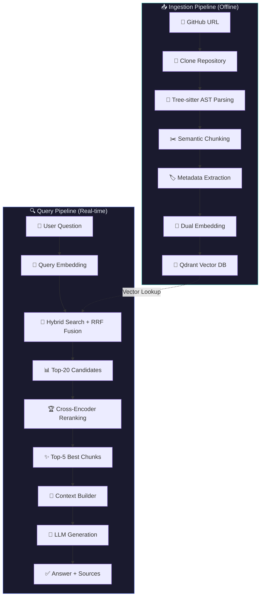
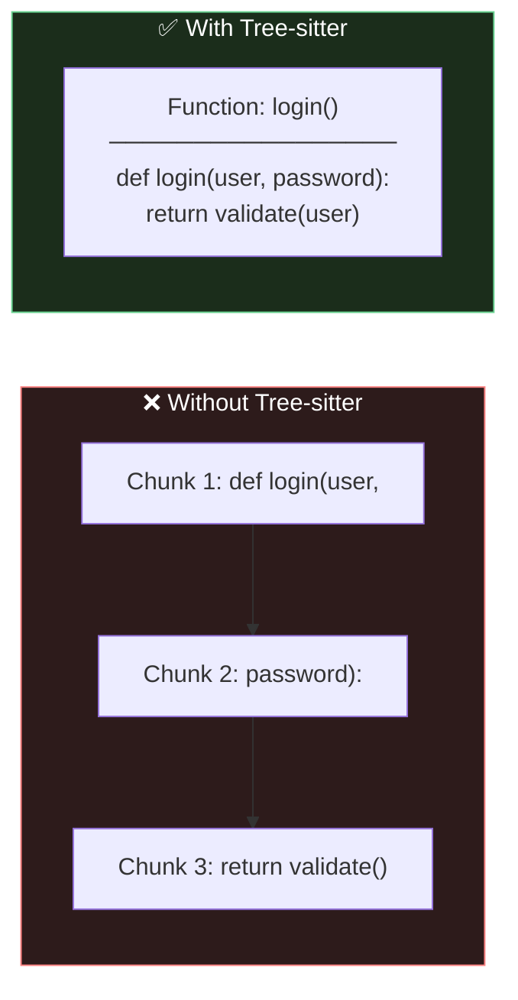
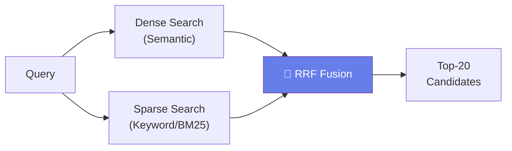

<p align="center">
  
  
  
  
  
</p>

<h1 align="center">🔍 CodeBase QA Agent</h1>

<p align="center">
  <strong>Ask natural language questions about any GitHub codebase and get accurate, source-cited answers.</strong>
</p>

<p align="center">
  An advanced RAG (Retrieval-Augmented Generation) pipeline that combines <br/>
  Tree-sitter AST parsing, hybrid vector search, cross-encoder reranking, and LLM generation <br/>
  to deliver precise, context-aware answers about source code.
</p>

---

## 📋 Table of Contents

- [Overview](#-overview)
- [Architecture](#-architecture)
- [Pipeline Stages](#-pipeline-stages)
  - [Ingestion Pipeline](#1-ingestion-pipeline-offline)
  - [Query Pipeline](#2-query-pipeline-real-time)
- [Tech Stack](#-tech-stack)
- [Project Structure](#-project-structure)
- [Getting Started](#-getting-started)
- [Usage](#-usage)
- [Evaluation](#-evaluation)
- [Contributing](#-contributing)

---

## 🧠 Overview

**CodeBase QA Agent** is an end-to-end system that lets you ask questions about any GitHub repository in plain English and get accurate answers backed by actual source code references.

### The Problem

Traditional code search relies on keyword matching — you need to know the exact function name or variable. LLMs alone hallucinate or lack context about your specific codebase.

### The Solution

This project combines the best of both worlds:

| Approach | Limitation | Our Solution |
|---|---|---|
| **Keyword Search** | Misses semantic meaning | Hybrid vector search (dense + sparse) |
| **Naive Chunking** | Breaks functions mid-line | Tree-sitter AST-aware chunking |
| **Vector Search Alone** | Returns noisy results | Cross-encoder reranking |
| **LLM Without Context** | Hallucinations | RAG with source-cited answers |

---

## 🏗 Architecture



---

## 🔄 Pipeline Stages

### 1. Ingestion Pipeline (Offline)

The ingestion pipeline processes a GitHub repository and stores it as searchable vectors.

#### Stage 1 — Repository Cloning

```
Input:  https://github.com/pallets/click
Output: ./cloned_repos/click/
```

Clones the repository locally using GitPython. If already cloned, pulls the latest changes.

#### Stage 2 — Tree-sitter AST Parsing

Instead of treating code as plain text, we use **Tree-sitter** to build an Abstract Syntax Tree (AST).



**Supported Languages:**

| Language | Extensions | AST Nodes Extracted |
|---|---|---|
| Python | `.py` | `function_definition`, `class_definition`, `decorated_definition` |
| JavaScript | `.js` | `function_declaration`, `class_declaration`, `arrow_function` |
| TypeScript | `.ts` | `function_declaration`, `class_declaration`, `method_definition` |
| Java | `.java` | `method_declaration`, `class_declaration` |
| Go | `.go` | `function_declaration`, `method_declaration` |

#### Stage 3 — Semantic Chunking

Each AST node becomes an independent, semantically meaningful chunk:

```python
# ✅ One complete chunk
{
    "code": "def login(user, password):\n    token = jwt.encode(...)\n    return token",
    "name": "login",
    "type": "function_definition",
    "file": "src/auth.py",
    "language": "python",
    "start_line": 15,
    "end_line": 42
}
```

**Smart filtering** automatically skips:
- Noise directories: `.git`, `node_modules`, `__pycache__`, `.venv`, `dist`, `build`
- Noise files: test files, minified JS, migrations, generated code
- Stub functions (< 30 characters)

#### Stage 4 — Metadata Extraction

Every chunk is enriched with structured metadata for filtering and display:

```json
{
  "name": "login",
  "type": "function_definition",
  "file": "src/auth.py",
  "repo": "my-project",
  "language": "python",
  "start_line": 15,
  "end_line": 42
}
```

#### Stage 5 — Dual Embedding

Each chunk is embedded using **two complementary models**:

| Model | Type | Dimensions | Strength |
|---|---|---|---|
| `all-MiniLM-L6-v2` | Dense | 384 | Semantic similarity |
| `Qdrant/bm25` | Sparse | Variable | Keyword matching |

This hybrid approach captures both **semantic meaning** and **exact keyword matches**.

#### Stage 6 — Vector Storage

Embeddings + metadata are stored in **Qdrant Cloud**:

```
Qdrant Collection: repo_click
├── Dense vectors (384-dim, COSINE)
├── Sparse vectors (BM25)
└── Payload (code, metadata, file paths)
```

---

### 2. Query Pipeline (Real-time)

When a user asks a question, the query pipeline retrieves relevant code and generates an answer.

#### Stage 7 — Query Embedding

The user's question is embedded using the **same models** as ingestion:

```
"How does authentication work?"
        ↓
Dense Vector: [0.12, -0.34, 0.56, ...] (384-dim)
Sparse Vector: {auth: 2.1, work: 0.8, implement: 1.5}
```

#### Stage 8 — Hybrid Search with RRF Fusion

Both dense and sparse searches run in parallel on Qdrant, then results are fused using **Reciprocal Rank Fusion (RRF)**:



> **Why RRF?** Dense search catches semantic matches ("authentication" ≈ "login"), while sparse search catches exact terms ("jwt_token"). RRF merges both ranked lists into a single superior ranking.

#### Stage 9 — Cross-Encoder Reranking

The top-20 candidates are **reranked** using a cross-encoder model for precise relevance scoring:

```
Input: (question, chunk) pairs → Cross-Encoder → Relevance score

Before Reranking:              After Reranking:
1. login()         0.72        1. jwt_middleware()   0.98  ✅
2. forgot_password() 0.70      2. login()            0.95  ✅
3. jwt_middleware() 0.68       3. forgot_password()  0.40  ❌
4. profile_update() 0.65      4. profile_update()   0.15  ❌
```

> **Why Reranking?** Vector search is fast but approximate. Cross-encoders jointly process the query-document pair for much more accurate relevance — dramatically improving answer quality.

#### Stage 10 — Context Building

The top-5 reranked chunks are formatted into structured context:

```markdown
### Source 1 (relevance: 0.98)
**File**: `src/middleware.py`
**Symbol**: `jwt_middleware` (function_definition)
**Lines**: 15–42

​```python
def jwt_middleware(request):
    token = request.headers.get("Authorization")
    ...
​```
```

#### Stage 11 — LLM Generation

The structured context + question are sent to **Llama 3.3 70B** via Groq:

```
System Prompt (code-aware instructions)
    +
Formatted Code Context (top-5 chunks)
    +
User Question
    ↓
Llama 3.3 70B (via Groq API)
    ↓
Answer with file/function/line references
```

---

## 🛠 Tech Stack

| Component | Technology | Purpose |
|---|---|---|
| **AST Parsing** | Tree-sitter | Language-aware code chunking |
| **Dense Embeddings** | all-MiniLM-L6-v2 | Semantic vector representation (384-dim) |
| **Sparse Embeddings** | Qdrant/BM25 | Keyword-based vector representation |
| **Vector Database** | Qdrant Cloud | Hybrid search with RRF fusion |
| **Reranker** | cross-encoder/ms-marco-MiniLM-L-6-v2 | Precise relevance scoring |
| **LLM** | Llama 3.3 70B (Groq) | Code-aware answer generation |
| **UI** | Streamlit | Interactive web interface |
| **Evaluation** | RAGAS | Retrieval & generation quality metrics |

---

## 📁 Project Structure

```
CodeBase-QA-Agent/
│
├── embeddings.py        # Shared model loader (singleton pattern)
│                        #   → Dense: all-MiniLM-L6-v2
│                        #   → Sparse: BM25
│                        #   → Reranker: CrossEncoder
│
├── chunker.py           # Tree-sitter AST parsing & semantic chunking
│                        #   → 5 languages supported
│                        #   → Smart file/directory filtering
│
├── ingest.py            # Ingestion pipeline
│                        #   → Clone repo → Parse → Embed → Store
│                        #   → Batch embedding & upload
│
├── retriever.py         # Query pipeline (stages 7-9)
│                        #   → Hybrid search (dense + sparse + RRF)
│                        #   → Cross-encoder reranking
│
├── generator.py         # LLM pipeline (stages 10-11)
│                        #   → Context builder
│                        #   → Groq/Llama 3.3 70B generation
│
├── router.py            # Orchestration layer
│                        #   → Connects retrieval + generation
│                        #   → Collection management
│
├── app.py               # Streamlit UI
│                        #   → Repo management sidebar
│                        #   → Q&A interface with source viewer
│
├── evaluate.py          # RAGAS evaluation framework
│                        #   → Faithfulness, relevancy, precision, recall
│
├── requirements.txt     # Python dependencies
├── pyproject.toml       # Project configuration
├── .env                 # API keys (not committed)
└── .gitignore           # Git ignore rules
```

---

## 🚀 Getting Started

### Prerequisites

- Python 3.11+
- [Qdrant Cloud](https://cloud.qdrant.io/) account (free tier available)
- [Groq API](https://console.groq.com/) key (free tier available)

### Installation

1. **Clone the repository**

```bash
git clone https://github.com/sarthaksingh17/CodeBase-QA-Agent-.git
cd CodeBase-QA-Agent-
```

2. **Create virtual environment**

```bash
python -m venv .venv

# Windows
.venv\Scripts\activate

# macOS/Linux
source .venv/bin/activate
```

3. **Install dependencies**

```bash
pip install -r requirements.txt
```

4. **Configure environment variables**

Create a `.env` file in the project root:

```env
GROQ_API_KEY=your_groq_api_key_here
QDRANT_URL=https://your-cluster-id.region.cloud.qdrant.io
QDRANT_API_KEY=your_qdrant_api_key_here
```

---

## 💡 Usage

### 1. Ingest a Repository

```bash
python ingest.py
```

Or modify `MY_REPOS` in `ingest.py` to add your repositories:

```python
MY_REPOS = [
    "https://github.com/pallets/click",
    "https://github.com/your-org/your-repo",
]
```

### 2. Launch the UI

```bash
streamlit run app.py
```

Open **http://localhost:8501** in your browser.

### 3. Ask Questions

Select a repository from the sidebar and ask questions like:

- *"How does authentication work?"*
- *"What does the login function do?"*
- *"Explain the middleware pipeline"*
- *"How are command groups handled?"*

### 4. Programmatic Usage

```python
from router import ask

result = ask(
    question="How does Click handle command groups?",
    collection_name="repo_click",
    top_k_search=20,
    top_k_rerank=5,
)

print(result["answer"])
for source in result["sources"]:
    print(f"  [{source['score']:.3f}] {source['name']} → {source['file']}")
```

---

## 📊 Evaluation

Run the RAGAS evaluation suite to measure pipeline quality:

```bash
python evaluate.py
```

**Metrics measured:**

| Metric | What It Measures |
|---|---|
| **Faithfulness** | Does the answer match the retrieved context? (No hallucinations) |
| **Answer Relevancy** | Is the answer relevant to the question asked? |
| **Context Precision** | Are the retrieved chunks actually relevant? |
| **Context Recall** | Did we retrieve all the needed chunks? |

---

## 🔮 Why This Architecture?

### Naive RAG vs. This System

```
Naive RAG:
  Text → Fixed-size chunks → Single embedding → Vector search → LLM
  Problems: Broken functions, noisy results, poor answers

This System:
  Code → AST parsing → Semantic chunks → Hybrid embeddings → Hybrid search → Reranking → LLM
  Result: Complete functions, precise retrieval, accurate answers
```

### Key Differentiators

| Feature | Benefit |
|---|---|
| **Tree-sitter AST parsing** | Never breaks a function mid-line |
| **Hybrid search (Dense + Sparse)** | Catches both semantic and keyword matches |
| **RRF fusion** | Best-of-both-worlds ranking |
| **Cross-encoder reranking** | Dramatically improves precision |
| **Enriched metadata** | Enables filtering by language, file, type |
| **Source-cited answers** | Every claim is traceable to code |

---

## 🤝 Contributing

Contributions are welcome! Feel free to:

1. Fork the repository
2. Create a feature branch (`git checkout -b feature/amazing-feature`)
3. Commit your changes (`git commit -m 'Add amazing feature'`)
4. Push to the branch (`git push origin feature/amazing-feature`)
5. Open a Pull Request

---

## 📄 License

This project is open source and available under the [MIT License](LICENSE).

---

<p align="center">
  Built by  <a href="https://github.com/sarthaksingh17">Sarthak Singh</a>
</p>
